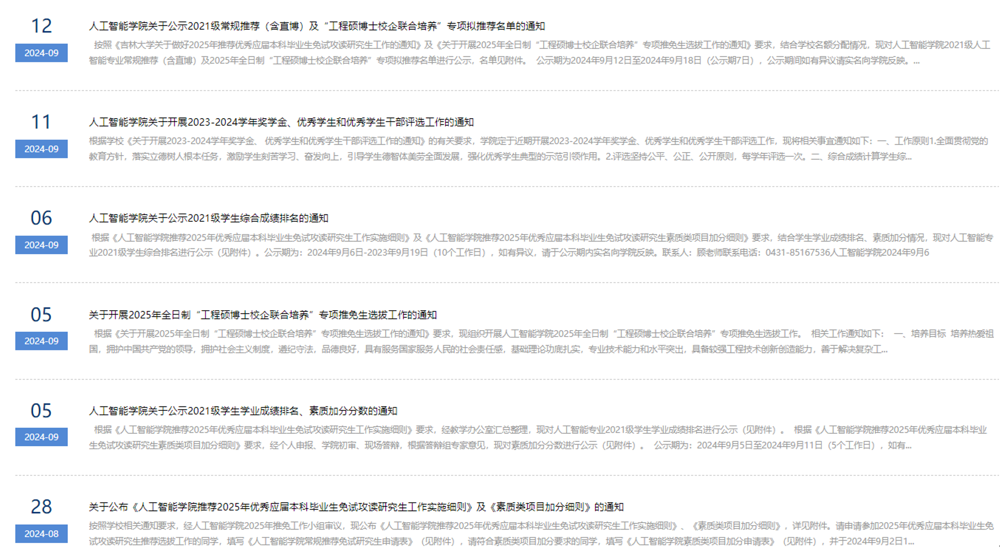
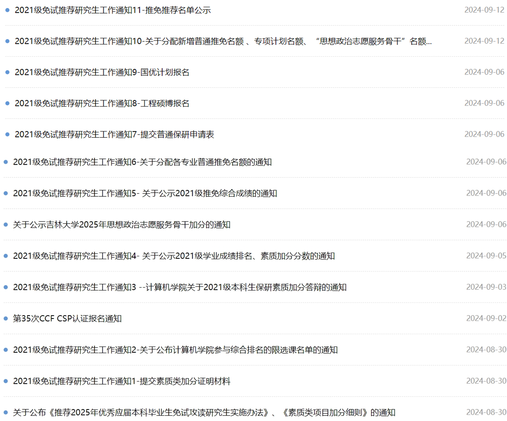
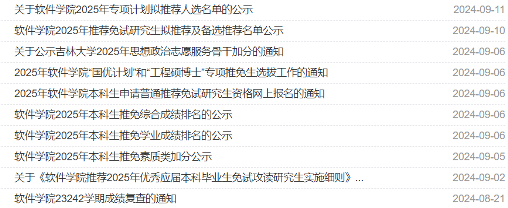

[TOC]

# 一、保研政策

## ！！！学会看通知：https://oa.jlu.edu.cn

## （一）JlU保研政策

政策文件：[吉林大学推荐优秀应届本科毕业生免试攻读研究生工作管理办法](./pdf/吉林大学推荐优秀应届本科毕业生免试攻读研究生工作管理办法.pdf)

### 1、概述

保研分为普通推荐和各项专项推荐：包括校内工程硕博+国防科工补偿+国优计划+支教保研+行政保研

>2020级名额分配通知：
>
>1.学校根据教育部批准下达我校当年推荐免试攻读硕士学位研究生的总名额，在考虑各学院本科应届毕业生人数的基础上，兼顾学校学科及专业整体发展情况的前提下进行分配，制定了《2024年推荐优秀应届本科毕业生免试攻读研究生推荐名额分配表》（见附件2）。**如有因学生不符合条件或自愿放弃而出现空余名额时，学院需将空余名额返还学校**，若有挪用情况，下一年度按比例扣除名额。学校将返还名额用于对“双一流”建设学科、国家级一流本科专业和国家重大需求学科等给予重点支持。
>
>2.学校组织开展的“直博生”校内预选工作中，确定了236名学生获得推免资格，**其名额涵盖在此次分配给各学院的总名额中，所占指标由学院统筹安排**。各学院要根据“管理办法”中“直博生”推荐条件，对以上学生的推荐资格进行进一步审核确认，最终确定人选。
>
>3.“研究生支教团”名额13个、“国防科工单位补偿计划”名额14个、全日制“工程硕博士校企联合培养”专项名额43个、“国家优秀中小学教师培养计划”专项名额32个，学校统一掌握，按教育部有关规定执行。

#### a. 常规推荐（保外，22%）

> 普通推荐包括 a.常规推荐（保外）+ b. 校内直博。

- **基础要求**：学业成绩平均学分绩点（GPA）2.5及以上，**允许曾有1门必修课程或限选课程不及格**，但必须在当年推免工作开始前重修通过。
- 极端数据：计院物联网专业2021级绩点2.6保研成功。。。（按人数划分物联网有十几个保研名额，rk7的绩点2.6具备保研资格，rk8<2.5不具备保研资格，剩余名额由学院重新分配给计科和网安）
- **排名要求**：

  - 成绩排名**以第一次考试成绩为准**，重修、加分的成绩不参与排名计算。经教务处批准的**缓考、补考成绩，按第一次考试成绩**计算排名。

  - 以**学业成绩**30%为选拔线，**综合排名**达到选拔线及以上的学生**具备推免资格**。
    - 22级65*30%=19.5，以rk19的**学业绩点**为选拔线，**向下取整，不是四舍五入**。
    
    - 假如rk20有加分，加分后的综合绩点高于选拔线，rk20也具备推免资格。
    
    - 假如rk30发了ccfa，加分0.4，加分后的综合绩点高于选拔线，rk30也具备推免资格。
  
- **具备推免资格≠保研成功**：

  - 30%的人具有保研资格，但是学校分配的**保外名额至高22%**（22级第一次分配名额为18%，最终20%），后面的同学可以选择工程硕博（保内），详见后文。
  - 出国=放弃推免资格，在选拔线(学业成绩的前30%)内名额顺延。
    - 20级出国两个、直博两个，资格线内（rk10）无人可排，实际保外6人，学院将2个空余名额返还学校。
    - 如果要出国，**必须在9月推免资格确定前提交材料放弃保研资格**，不能既要又要。
    - 不要奢望rk靠前的同学出国，21、22级均无人出国。
- **rk20%边缘人注意**：
  - 常规推荐（保外）名额存在二次分配，树洞、xhs有很多帖子，已知计软每年能要到3-5个名额，人院21级申请到2个，22级申请到1个。（虽然是小范围内公开的秘密，但本文不做讨论，详情可咨询学长）
    - 计院公告：2020级第二次分配3个，2019级5个，2018级4个……
    - 2021级计院第二次分配5个，人院2个，软院未知
  - **不要依赖二次名额，这个名额是不确定的（学校给咱们的工程硕博名额逐渐增多，未来二次申请难度或许越来越大）。**
- **普通推荐历年比例**：

|        | 常规推荐（保外） | 二次分配（保外） | 校内直博（最终） |    第一次分配    |  最终保外率   |
| ------ | :--------------: | :--------------: | :--------------: | :--------------: | :-----------: |
| 2020级 |        8         |        -2        |        2         |   8/36=22.22%    |  8/36=22.22%  |
| 2021级 |        11        |        +2        |        1         | 11/57=**19.30%** |  13/57=22.8%  |
| 2022级 |        12        |        +1        |        2         | 12/65=**18.46%** | 13/65=**20%** |

**综上，想要安稳保外，综合成绩（学业绩点+加分）必须达到前18%，且近年来加分越来越多，个人觉得学业成绩在前15%才算安全，谨防各路加分刺客。这里建议边缘人7月期末考试后私下互通有无，不要刻意隐瞒加分，以便大家做好未来规划。**

#### b. 直博（保内，30%）

##### 21级直博流程

6月13日前，各单位填写《吉林大学2025年招收优秀应届本科毕业生直接攻读博士学位研究生推荐接收名额申请表》。不按期申报的单位视为不接收“直博生”，学校不再下拨推荐、接收名额。

6月18日前，学校下拨“直博生”推荐及接收名额。

6月21日前，各招生单位填报《吉林大学2025年招收优秀应届本科毕业生直接攻读博士学位研究生招生专业计划汇总表》，报研究生招生办公室备案。

6月30日前，各培养单位制定“直博生”推荐工作实施方案，报教务处备案，组织符合条件的学生自愿报名、材料审核、确定“直博生”推荐人选并公示，公示期3天。

7月8日前，各招生单位组织预选考核，确定预选“**直博生**”名单，并在本单位网站公示3天。填报《吉林大学2025年招收优秀应届本科毕业生直接攻读博士学位研究生预选合格学生名单》，上报研究生招生办公室。

8月份，研究生招生办公室统一公示“直博生”预选合格学生名单。

9月份，各学院对“直博生”预选考核合格的学生进行条件复核，按照推免工作流程，完成相关推荐工作。

10月份，各招生单位组织复核通过的“直博生”预选学生登录“全国推荐免试攻读研究生（免初试、转段）信息公开暨管理服务系统”（网址：[https://yz.chsi.com.cn/tm）](https://vpn.jlu.edu.cn/https/44696469646131313237446964696461b362b26b0bdba259cf54ea22d46b/tm）填报志愿并参加复试。)，接收拟录取通知。学校统一公示拟录取“直博生”名单。

##### 名额分配

| 学院代码 | 学院名称             | 直博生推荐名额 | 直博生接收名额 |
| -------- | -------------------- | -------------- | -------------- |
| 503      | 计算机科学与技术学院 | 12             | 12             |
| 504      | 软件学院             | 10             |                |
| 506      | 人工智能学院         | 3              | 5              |

计软给了很多名额，但基本每年报名的只有一两个。

##### 政策解读

- **排名要求**：
  - **直博要求前5学期、前6学期学业成绩均在前30%**，假如最终达不到要求，即使6月被学院推荐，8月也会被学校审核刷掉，计软人均有案例。
- 校内直博人选每年6月提前确定，**确定直博后便不能再申请保外**。
  - 保外名额至高22%，成绩在22-30%的同学，求稳可以选择直博本校，即使综排后具备保外资格也不能改变主意保外。
- 虽然直博是另外的计划，且据说直博名额不占用保研名额，但个人觉得在学校统筹安排时，**直博多则分配的外保名额少**。
  - 假如申请直博的过多，**确信最终外保名额一定会变少**（可自行分析各个学院历年直博vs保外名额），相当于22-30%直博可能会挤掉前面同学的保外资格，相当于直博优先于普通保研。
  - 假设22级没有直博，那常规推荐可能直接就13个了。
  - **边缘人不愿在本学院待，没有院内直博的勇气，就要承担无法保外的风险。**
- 学校审核通过后，会发布预选合格名单，**直博结束**，等9月交材料填系统即可。
  - 

#### c. 工程硕博士校企联合培养（保内，30%）

> 实施产教融合培养模式，与行业前沿大型企业开展联合培养，**采取校企双导师制**。工程硕士研究生基础学制3年，其中1年左右在学校完成课程学习，2年左右在企业完成专业实践、毕业设计或学位论文工作。工程博士研究生（直博生）基础学制5年，其中2年左右在学校完成课程学习，3年左右在企业完成专业实践、毕业设计或学位论文工作。具体培养计划以各专业培养方案为准。

- **基础要求、排名要求参见[普通推荐](####a. 常规推荐（保外，22%）)部分**
- **rk30%边缘人注意**：
  - 普通推荐之后，**综合成绩在30%的选拔线**以前的同学具备申请工程硕博的资格。
  - 22级65*30%=19.5，以rk19的**学业绩点**为选拔线，**不四舍五入**。
    - 假如rk20有加分，加分后的综合绩点高于选拔线，但已不在普通推荐名额内，可以申请校内工程硕博。
- **关于工程硕博的培养方案，可咨询相关学长学姐**
- **工程硕博历年名额**：

2020级2人：

| **校内招生单位** | **硕士或博士** | **专业代码** | **招生专业名称** | **计划数** | **企业** | **下属单位及所在地点**     |
| ---------------- | -------------- | ------------ | ---------------- | ---------- | -------- | -------------------------- |
| 人工智能学院     | 硕士           | 085410       | 人工智能         | 2          | 中国一汽 | 一汽奔腾轿车有限公司，长春 |

2021级7人：

| 校内招生单位 | 硕士或博士 | 招生专业代码 | 招生专业名称 | 计划数 |     企业     |            下属单位名称及单位所在地点            |
| :----------: | :--------: | :----------: | :----------: | :----: | :----------: | :----------------------------------------------: |
| 人工智能学院 |    博士    |    085410    |   人工智能   |   1    | 中国机械总院 | 中国机械总院集团北京机电研究所有限公司  （北京） |
| 人工智能学院 |    博士    |    085410    |   人工智能   |   1    |   中国一汽   |         中国第一汽车集团有限公司（长春）         |
| 人工智能学院 |    博士    |    085410    |   人工智能   |   1    |   中国一汽   |         中国第一汽车集团有限公司（长春）         |
| 人工智能学院 |    硕士    |    085410    |   人工智能   |   4    |   中国一汽   |         中国第一汽车集团有限公司（长春）         |

3博+4硕=7，2021级最后报了2个工程硕士，1个工程博士

（理论上其实计软同学也可以申请人院的工程硕博）

2022级9人：

| 校内招生单位 | 硕士或博士 | 专业领域 | 招生专业代码 | 招生专业名称 | 计划数 |   企业   |      下属单位名称及单位所在地点      |
| ------------ | :--------: | :------: | :----------: | :----------: | :----: | :------: | :----------------------------------: |
| 人工智能学院 |    博士    | 人工智能 |    085410    |   人工智能   |   1    | 中国联通 |         吉林省分公司（长春）         |
| 人工智能学院 |    博士    | 人工智能 |    085410    |   人工智能   |   1    | 一汽集团 |           解放公司（长春）           |
| 人工智能学院 |    博士    | 人工智能 |    085410    |   人工智能   |   1    | 一汽集团 |          一汽-大众（长春）           |
| 人工智能学院 |    硕士    | 智慧能源 |    085410    |   人工智能   |   1    | 中国黄金 | 中国黄金集团数智科技有限公司（北京） |
| 人工智能学院 |    硕士    | 人工智能 |    085410    |   人工智能   |   1    | 一汽集团 |          一汽-大众（长春）           |
| 人工智能学院 |    硕士    | 人工智能 |    085410    |   人工智能   |   2    | 一汽集团 |          生产物流部（长春）          |
| 人工智能学院 |    硕士    | 人工智能 |    085410    |   人工智能   |   2    | 中国联通 |         吉林省分公司（长春）         |

**综上，假如不想考研，综排达到前30%就能保研（保内），但没有20%无法保外。且个人觉得，在学校层面，给咱们工程硕博名额太多了，会影响普通推荐名额二次申请。**

以21级为例：保外名额13个，直博1个（实际给了3个），工程3个（实际给了7个），17/57=29.8%，**最终官方宣传的推免率30%，**基本上只要综排过了30%的线就可以保内（仅人院有效）

#### d. 国防科工招生补偿计划（无名额）

oa:《关于2025年“国防科工招生补偿计划”接收我校推免生工作的通知》

- 计院、软院有，人院无
- 接收学校及名额
  - 1.国防科技大学9个名额。
  - 2.中国工程物理研究院2个名额。
  - 3.西北核技术研究所2个名额。

#### e. 国优计划（无名额）

oa:《关于开展2025年国家优秀中小学教师培养计划专项推免生选拔工作的通知》

|     **试点单位**     | **推荐名额** | **专业代码** |   **招生专业**   | **学位类别** | **学制** | **招生名额** |
| :------------------: | :----------: | :----------: | :--------------: | :----------: | :------: | :----------: |
| 计算机科学与技术学院 |      2       |    081200    | 计算机科学与技术 | 学术学位硕士 |   3年    |      2       |
|                      |              |    085404    |    计算机技术    | 专业学位硕士 |   3年    |              |
|       软件学院       |      2       |    083500    |     软件工程     | 学术学位硕士 |   3年    |      2       |
|                      |              |    085405    |     软件工程     | 专业学位硕士 |   3年    |              |

人院没有名额，但这个名额是接受名额，理论上可以去计软报名申请。。。当然只是理论（毕竟名额是人家学院的）

**普通保外，也可以关注一下外校的国优计划，甚至可以申请到华五的国优计划。**

#### f. 研究生支教团（支教保研）

oa：《支教团》

申请“研究生支教团”推荐的学生，**允许曾有2门必修课程或限选课程不及格**，但必须在当年推免工作开始前重修通过。

#### g. “2+3”专职辅导员（行政保研）

oa：《专职辅导员》

行政保研的成绩要求会进一步放松，具体看oa通知。

**支教保研、行政保研全校仅十几个名额，且党员身份（含预备）优先**

### 2、流程安排

#### 2020级=2024届

| 2023年  |           流程           |                             通知                             |
| :-----: | :----------------------: | :----------------------------------------------------------: |
| 9月1日  |      各学院确定排名      | [关于开展2024年推荐优秀应届本科毕业生免试攻读研究生学业成绩核对和综合排名工作的通知](./html/9-1排名.mhtml) |
| 9月19日 | **学校分配普通保研名额** | [吉林大学关于做好2024年推荐优秀应届本科毕业生免试攻读研究生工作的通知](./html/9-19推免名额.mhtml) |
| 9月20日 |      目前人院无资格      | [关于2024年“国防科工招生补偿计划”接收我校推免生工作的通知](./html/9-20国防科大补偿10个名额.mhtml) |
| 9月20日 |      目前人院无资格      | [关于开展2024年国家优秀中小学教师培养计划专项推免生选拔工作的通知](./html/9-20国优计划.mhtml) |
| 9月22日 | **学校分配工程硕博名额** | [关于开展2024年全日制“工程硕博士校企联合培养”专项推免生选拔工作的通知](./html/9-22工程硕博.mhtml) |
| 9月26日 |     学校公示推荐名单     | [关于公布吉林大学2024年推荐优秀应届本科毕业生免试攻读研究生名单的通知](./html/9-26推荐名单.mhtml) |

2020级第一年国优计划，因而时间紧张~

#### 2021级=2025届

|   2024年   |                   吉林大学电子校务平台通知                   |
| :--------: | :----------------------------------------------------------: |
|  8月21日   | 关于开展2025年推荐优秀应届本科毕业生免试攻读研究生学业成绩核对和综合排名工作的通知 |
| **9月4日** | **吉林大学关于做好2025年推荐优秀应届本科毕业生免试攻读研究生工作的通知** |
| **9月5日** | **关于开展2025年全日制工程硕博士校企联合培养专项推免生选拔工作的通知** |
|   9月5日   | 关于开展2025年国家优秀中小学教师培养计划]专项推免生选拔工作的通知 |
|   9月5日   |   关于2025年“国防科工招生补偿计划”接收我校推免生工作的通知   |
|   未公布   | 关于公布吉林大学2025年推荐优秀应届本科毕业生免试攻读研究生名单的通知 |

工程硕博名额会在普通推荐名额通知后的第二天发布。

#### 2023级

网传教育部规定明年7月确定好保研资格，如果是真的，时间线提前两个月，将更有利于边缘人进行未来规划。

## （二）学院政策（2021级）

### 人院

人院教务速度>>计软，胡老师、张老师yyds

大概流程如下：

- 9月4号，学校公布各学院保研名额（第一批11+1）
- 9月5号，学院公布学业成绩排名并进行，并通知加分工作。
- 9月5号下午5点，学院要求《自行计算综合gpa》并在6号10点前于大群内接龙是否申报工程硕士（工程硕博7号截止报名，计院软院都是拖到6号下午才发的通知）
- 9月6号下午公布综合成绩排名，确定保研推荐顺序。
- 第二次名额分配结果11号晚上才出，最终常规推免13+1。

### 计院

条理清晰，公开透明：

### 软院

具体名额分配情况在学院群内通知不公示，大数据专业实惨保研率11/77=14.2%，隔壁软工69/335=20.6%

### 计vs软vs人保研数据

#### 2024年

| **年级** | **学院代码** | **学**  **院**           | **总名额** | **常规推荐名额** | **直博名额** |
| -------- | ------------ | ------------------------ | ---------- | ---------------- | ------------ |
| 2020     | 503          | **计算机科学与技术学院** | 105        | 103              | 2            |
| 2020     | 504          | **软件学院**             | 83         | 79               | 4            |
| 2020     | 506          | **人工智能学院**         | 10         | 8                | 2            |

AI保研率：8/36=22.2%

#### 2025年

| **年级** | **学院代码** | **学**  **院**           | **总名额** | **常规推荐名额** | **直博名额** |
| -------- | ------------ | ------------------------ | ---------- | ---------------- | ------------ |
| 2021     | 503          | **计算机科学与技术学院** | 102        | 98               | 4            |
| 2021     | 504          | **软件学院**             | 81         | 80               | 1            |
| 2021     | 506          | **人工智能学院**         | 12         | 11               | 1            |

AI保研率：11/57=19.3%

软院大数据11/77=14.2%实惨，软工69/335=20.6%

计院物联网绩点2.6即保研。。。不做评价

#### 2026年

| **年级** | **学院代码** | **学**  **院**           | **总名额** | **常规推荐名额** | **直博名额** |
| -------- | ------------ | ------------------------ | ---------- | ---------------- | ------------ |
| 2021     | 503          | **计算机科学与技术学院** | 93         | 93               | 0            |
| 2021     | 504          | **软件学院**             | 89         | 88               | 1            |
| 2021     | 506          | **人工智能学院**         | 14         | 12               | 2            |

AI保研率：12/65=**18.46%**

**第二次名额申请到1个，最终保外率13/65=20%**。虽然算上直博、工程硕博，保研率可以达到30%，但这种算法无异于耍流氓。

## （三）加分规则

> 加分上限0.4

### 一、科研成果

| **加分项目**                 | **加分对象**                                                 | **认定加分值**                                | **备注** |                                                              |
| ---------------------------- | ------------------------------------------------------------ | --------------------------------------------- | -------- | ------------------------------------------------------------ |
| 大学生创新创业计划项目       | 国家级优秀结题项目                                           | 负责人                                        | 0.1 GPA  | 学院认定，排名要与立项、中期检查、结题环节一致               |
|                              |                                                              | 第二名                                        | 0.05 GPA |                                                              |
| 学术论文  （计算机专业领域） | 中国计算机学会推荐国际学术会议和期刊目录（最新）  中国科学院文献情报中心期刊分区（最新） | CCF-A类、清华推荐A类 ；中科院期刊分区一区论文 | 0.4 GPA  | 学院认定， 必须是第一作者， 署名第一单位必须是吉林大学人工智能学院，加分前要求答辩，由推免工作小组组织相关专家认定。 |
|                              |                                                              | CCF-B类、清华推荐B类；中科院期刊分区二区论文  | 0.2 GPA  |                                                              |

 

- **注意，清华a也是a，清华b也是b**

### 二、竞赛获奖 

- 赛制要求每组参赛人数不足6人的，认定实际获奖人，超过6人的（含6人），认定前6人，获奖人数每人加分相同。 
- 学院认定， **国际竞赛（洲际比赛）等同于国家级竞赛；设特等奖的赛事， 按照特等对一等的关系顺延**；获奖排名以获奖证书为准；以小组形式参赛有明确个人成绩的，按照个人成绩进行排序；以小组参赛无明确个人成绩的，具体排名根据个人贡献，并参考指导教师意见进行排序。  
  - **举例，美赛为C类竞赛，O=国一加分0.1、F=国二加分0.05、M=国三加分0.02、H=啥也不是**

| 加分项目                                                     | 认定加分值 |
| ------------------------------------------------------------ | ---------- |
| A类竞赛国家级一等奖（金奖）                                  | 0.4 GPA    |
| A类竞赛国家级二等奖（银奖）；B类竞赛国家级一等奖（金奖）     | 0.2 GPA    |
| A类竞赛国家级三等奖（铜奖）；B类竞赛国家级二等奖（银奖）；C类竞赛国家级一等奖（金奖） | 0.1 GPA    |
| B类竞赛国家级三等奖（铜奖）；C类竞赛国家级二等奖（银奖）     | 0.05 GPA   |
| C类竞赛国家级三等奖（铜奖）                                  | 0.02 GPA   |

**说明：**

1.**同类成果中不累计加分**，取代表作的最高加分计入推免综合成绩。

2.素质类项目加分包括科研成果、竞赛获奖、入伍服兵役、志愿服务、国际组织实习五个类别。属于同一类别的加分项目只计算最高加分项，不累计加分；属于不同类别的加分项可以累积加分。**但是某名同学最终计入综合排名的素质类加分成绩的GPA不超过0.4**。科研成果、学科竞赛获奖的加分政策和加分标准由学院制定并认定。体育竞赛、艺术竞赛、入伍服兵役、志愿服务、国际组织实习等项目和类别的加分政策及加分标准原则上由学校相关部门统一制定并认定。

3.供参考的学科竞赛列表：ACM-ICPC国际大学生程序设计竞赛,中国大学生服务外包创新创业大赛,中国高校计算机大赛（大数据挑战赛）,CCSP大学生计算机系统与程序设计竞赛,全国大学生物联网设计竞赛,CCPC中国大学生程序设计竞赛,全国大学生信息安全竞赛,全国大学生信息安全竞赛（信息安全作品赛；创新实践能力赛）,中国高校计算机大赛（团体程序设计天梯赛，移动应用创新赛，网络技术挑战赛，人工智能创意赛，微信小程序开发赛）,全国大学生数学建模竞赛,美国大学生数学建模竞赛,全国高校密码数学挑战赛，全国大学生数学竞赛，尚未列入学科竞赛列表的其他竞赛，在学院评审环节酌情认定。

4.非计算机类学科竞赛的A、B、C类奖项的认定加分值对应减半。

**关于竞赛等级可参阅《附件2：吉林大学本科生学科竞赛体系.pdf》**

# 二、保外

> 谨记：只要想出去，就都能出去。真的不存在保外失败，能入营就是胜利。

## 消息来源

绿群（qq）：943826679、620876705、612207580

Github：

https://github.com/CS-BAOYAN/CSBasicKnowledge：关于CS、AI和 EE 的知识

https://github.com/CS-BAOYAN/CS-BAOYAN-2024：记录保研相关的材料准备

https://github.com/CS-BAOYAN/CSSummerCamp2024：夏令营相关信息

https://github.com/CS-BAOYAN/CSLabInfo2024：实验室招生广告

（每年都会更新，这几个已经是过去式了）

## 野路子

- 报名的时候海投，各个院校的的政策可能突然就变了，或许变成海营了，或许突然发offer了。
- 有名校情结：

  - 可以看一些偏门的学院，rk1无法进清深，但是或许能进清深海洋工程学院
  - 也可以关注外校的国优计划
- rk1有入营无限可能，随便报

  - 你可以是学业成绩的rk1，也可以是综合排名的rk1，甚至可以是第六学期成绩没出完时，某一阶段的rk1
- rk2海投各高校，虽然最后可能只入自动化所、中科大，但或许某个华五突然就变政策了，扩招什么的，不尝试永远没有机会。
- rk2.3.4，中科院、中科大的各个系随便报，入营即胜利，候补即offer，一定会被鸽穿（当然不包含自所这种）
- 经典的海营：西交软、天大、浙软。是9即入营，不看rk，只看机试、面试。

21级夏令营很少拿到offer的，但大家预推免的结果都不错。被拒n次很正常，不要气馁，夏令营很难，预推免才是主战场，保外最终没有失败这个说法，只要努力了，一定可以走的出去；可能机试分低受挫，可能老师推荐入营但也没入，可能不同组面试方差极大，但只要尽力了，其它交给天意，大家都会有好结果的。虽然保研是一个人的战斗，但建议大家找个保研搭子，互相督促报名，至少当你遇到糟心事有人聊聊。

## To保研er

待到秋来九二八，大佬鸽完鼠鼠杀。

冲天鸽子飞出笼，满城都有offer拿！

时隔一年，记忆变得模糊了，就写这么多吧，希望对大家有所帮助。

